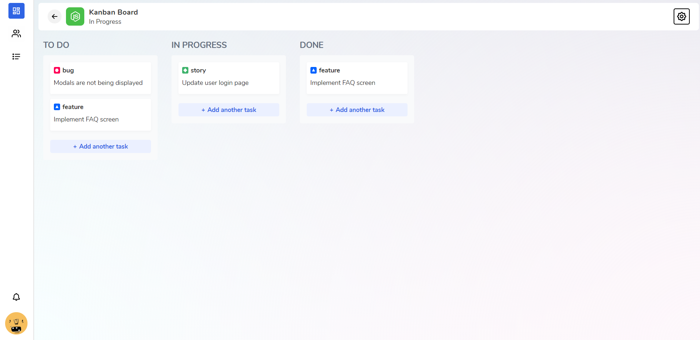
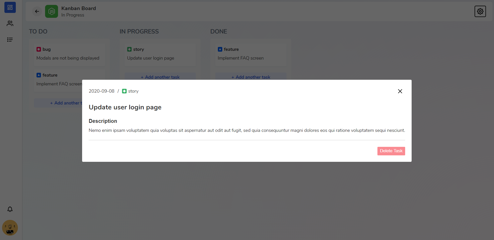
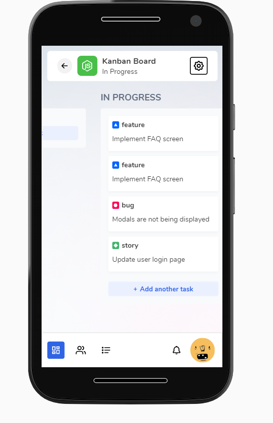

# 📝 Exercise - Kanban board

### Idea 💡

This is a layout setup exercise. Most of its functions are just stubs but one can still create, move around and delete cards from the kanban board.

### Shots 📷

## Sample 📺

A live version of the program can be found for testing at https://stupefied-jackson-4233c5.netlify.app/

## Running 🚀

This application can be executed with the command `yarn dev:server` (if you use yarn) or `npm run dev:server` (port: 3000)
